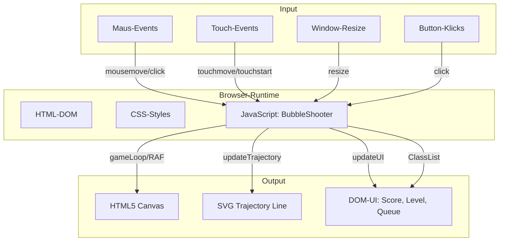
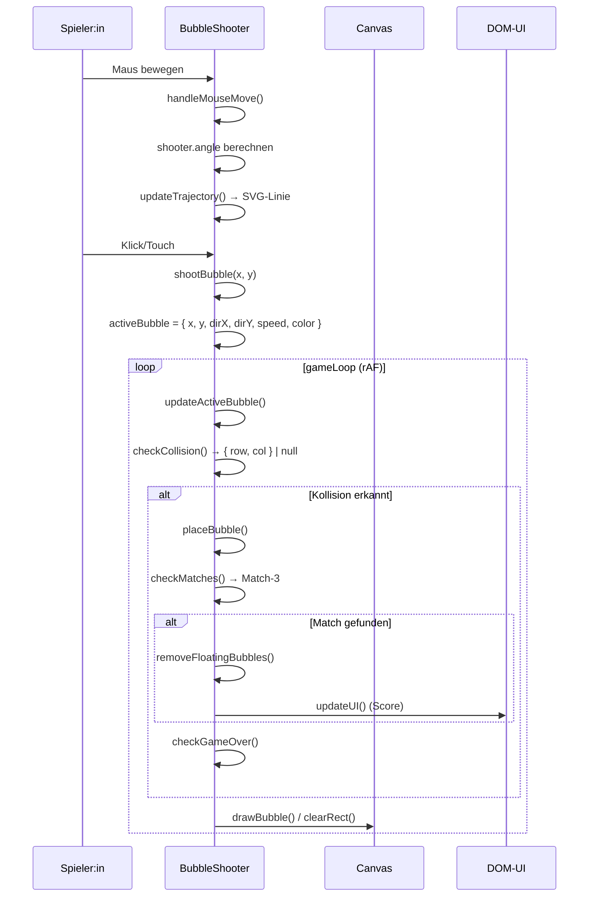
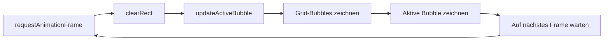
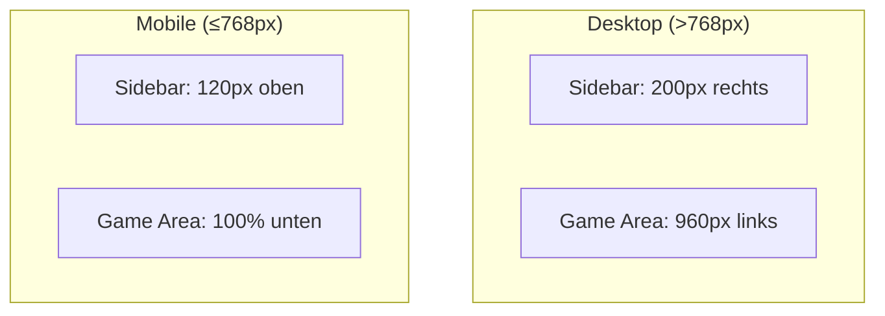

# Systemarchitektur – jabs

> Dokumentiert die Architektur des Bubble-Shooters als Single-File-Anwendung.

---

## 1. Überblick

**jabs** ist eine **Single-Page-Webanwendung (SPA)**, bestehend aus einer einzigen HTML-Datei (`index.htm`). Die Anwendung folgt einem **klassischen Game-Loop-Pattern** mit `requestAnimationFrame`.

```
┌─────────────────────────────────────────────────────────────────────┐
│                         index.htm (Single File)                      │
│                                                                      │
│  ┌──────────┐    ┌──────────────────┐    ┌────────────────────────┐ │
│  │   CSS     │    │    HTML (DOM)    │    │   JavaScript (ES6+)    │ │
│  │           │    │                  │    │                        │ │
│  │ Layout    │    │  <canvas>        │    │  class BubbleShooter   │ │
│  │ Responsive│    │  <svg>           │    │  ─────────────         │ │
│  │ Anim.     │    │  Sidebar (UI)    │    │  Grid-Management       │ │
│  │           │    │  Overlay (Game)  │    │  Kollisionserkennung   │ │
│  └──────────┘    │  Power-Up-Buttons│    │  Match-3 Logik         │ │
│                  └──────────────────┘    │  Rendering (Canvas)    │ │
│                                          │  Event-Handling        │ │
│                                          └────────────────────────┘ │
└─────────────────────────────────────────────────────────────────────┘
```

---

## 2. Komponenten-Diagramm



---

## 3. Datenfluss (Data Flow)



---

## 4. Schichten-Modell

### 4.1 Präsentationsschicht (UI)

| Komponente | Technologie | Aufgabe |
|---|---|---|
| **Game Area** | `<canvas id="gameCanvas">` | Rendering aller Bubbles und Effekte |
| **Trajektorie** | `<svg>` mit `<line>` | Zielhilfe-Linie (gestrichelt) |
| **Sidebar** | `<div class="sidebar">` | Score, Level, Bubbles-Queue |
| **Overlay** | `<div class="game-overlay">` | Game-Over / Neustart-Bildschirm |
| **Power-Ups** | `<div class="power-up-btn">` | Zielhilfe (🎯) und Bombe (💣) |
| **Bubble-Queue** | `<div class="bubble-queue">` | Anzeige der nächsten 5 Bubbles |

### 4.2 Anwendungslogik (BubbleShooter)

| Bereich | Methoden (Auswahl) | Beschreibung |
|---|---|---|
| **Grid-Management** | `createInitialGrid()`, `addRow()`, `updateGridPositions()` | Hexagonales Grid aufbauen und verwalten |
| **Kollision** | `checkCollision()`, `findBestPosition()` | Distanzbasierte Kollisionserkennung |
| **Matching** | `checkMatches()`, `findMatches()`, `getNeighbors()` | Match-3+ Erkennung mit BFS-ähnlicher Suche |
| **Floating** | `removeFloatingBubbles()`, `markConnected()` | Entfernt nicht verbundene Bubbles (BFS von Top-Row) |
| **Rendering** | `gameLoop()`, `drawBubble()` | Canvas-Rendering pro Frame |
| **Steuerung** | `handleMouseMove()`, `handleClick()` | Maus/Touch → Spiel-Aktionen |
| **Power-Ups** | `activateAimPowerUp()`, `activateBombPowerUp()` | Power-Up-Logik |
| **Level** | `nextLevel()`, `checkWinCondition()`, `checkGameOver()` | Spielfortschritt und Game-Over |

### 4.3 Datenmodell (zentraler State)

Alle relevanten Zustände sind Instanz-Eigenschaften der `BubbleShooter`-Klasse:

| Eigenschaft | Typ | Beschreibung |
|---|---|---|
| `this.grid` | `Array<Array<object\|undefined>>` | 2D-Grid: `grid[row][col] = { color, x, y, radius }` |
| `this.shooter` | `{ x: number, y: number, angle: number }` | Shooter-Position und -Winkel |
| `this.activeBubble` | `object \| null` | Fliegende Bubble: `{ x, y, dirX, dirY, speed, color, radius, powerUp }` |
| `this.currentBubble` | `string` | Farbe der aktuellen Bubble im Shooter |
| `this.nextBubbles` | `string[]` | Nächste 5 Farben in der Warteschlange |
| `this.score` | `number` | Aktuelle Punktzahl |
| `this.level` | `number` | Aktueller Level |
| `this.shotsFired` | `number` | Schüsse seit letztem Row-Push |
| `this.shotsPerRow` | `number` | Schüsse pro neuer Reihe (Standard: 5) |
| `this.gameRunning` | `boolean` | Spiel läuft / Game Over |
| `this.aimAssistShots` | `number` | Verbleibende Zielhilfe-Schüsse |
| `this.bombArmed` | `boolean` | Nächster Schuss ist eine Bombe |

---

## 5. Rendering-Pipeline



Das Rendering verwendet ausschließlich die **Canvas 2D API**:
- `ctx.clearRect()` – löscht den gesamten Canvas
- `ctx.createRadialGradient()` – 3D-Bubble-Effekte (Lichtpunkte, Schatten)
- `ctx.shadowColor` / `ctx.shadowBlur` – Schatten unter Bubbles

Die **Trajektorien-Linie** wird als SVG `<line>` über dem Canvas gerendert (Position: absolute, pointer-events: none).

---

## 6. Event-System

| Event | Handler | DOM-Ziel |
|---|---|---|
| `mousemove` | `handleMouseMove()` | `<canvas>` |
| `click` | `handleClick()` | `<canvas>` |
| `touchmove` | `→ handleMouseMove()` (wrapped) | `<canvas>` |
| `touchstart` | `→ handleClick()` (wrapped) | `<canvas>` |
| `resize` | `resizeCanvas()` | `window` |
| `click` (Aim) | `activateAimPowerUp()` | `#aimBtn` |
| `click` (Bomb) | `activateBombPowerUp()` | `#bombBtn` |
| `click` (Restart) | `restartGame()` | `#restartBtn` |

Touch-Events werden in synthetische Mouse-Events umgewandelt, sodass `handleMouseMove` / `handleClick` die zentralen Einstiegspunkte bleiben.

---

## 7. Responsive Layout



- **Layout-Wechsel** via `@media (max-width: 768px)` – von horizontaler zu vertikaler Anordnung
- **Canvas-Resize** bei jedem `window.resize`-Event: `resizeCanvas()` berechnet `bubbleRadius` und Grid-Maße dynamisch
- `--game-width` und `--sidebar-width` als CSS Custom Properties für konsistente Berechnungen
