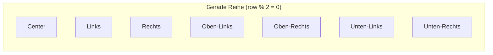
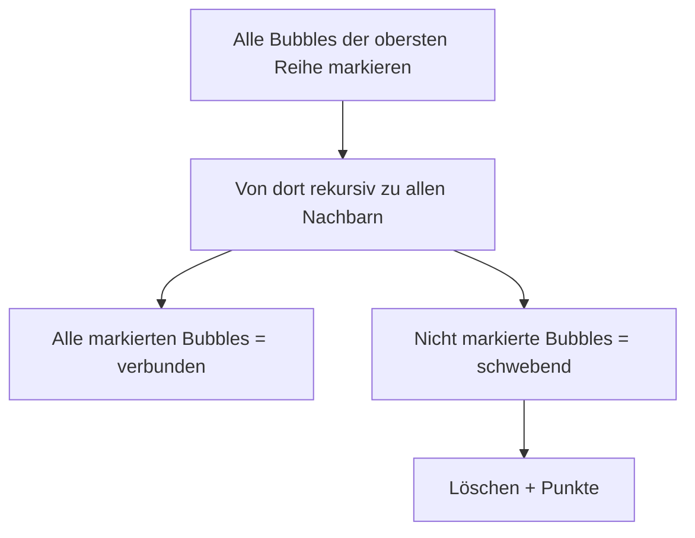

# Spiellogik – Game Mechanics

> Detaillierte Dokumentation der zentralen Spielmechaniken: Hexagonales Grid, Kollisionserkennung, Match-3, Floating Bubbles und Level-System.

---

## 1. Hexagonales Grid

### 1.1 Aufbau

Das Grid ist ein **2D-Array** (`this.grid[row][col]`), bei dem jede Zelle entweder ein Bubble-Objekt oder `undefined` (leer) enthält.

```
Reihe 0:  ● ● ● ● ● ● ● ● ● ● ● ● ● ● ●   (Offset: 0)
Reihe 1:   ● ● ● ● ● ● ● ● ● ● ● ● ● ● ●  (Offset: 1 × radius)
Reihe 2:  ● ● ● ● ● ● ● ● ● ● ● ● ● ● ●   (Offset: 0)
Reihe 3:   ● ● ● ● ● ● ● ● ● ● ● ● ● ● ●  (Offset: 1 × radius)
```

- **15 Spalten** (`fixedColumns`) – immer konstant
- **Start-Reihen**: 8 (`initialRows`)
- **Reihen-Offset**: Jede zweite Reihe ist um `bubbleRadius` nach rechts versetzt → hexagonale Anordnung

### 1.2 Positionierung

```javascript
getBubblePosition(row, col) {
    const offsetX = this.getRowOffset(row);  // this.rowOffsets[row] * bubbleRadius
    const x = this.gridLeftOffset + col * (this.bubbleRadius * 2) + this.bubbleRadius + offsetX;
    const y = this.gridTopOffset + row * this.rowHeight;
    return { x, y };
}
```

`this.rowOffsets[row]` ist die alleinige Quelle der Wahrheit für den Versatz einer Reihe – nicht `row % 2`. Für die initiale Grid-Erzeugung stimmen beide überein (Reihe 0 = 0, Reihe 1 = 1, …), aber nach einem `addRow()`-Push verschiebt sich das Muster; nur `rowOffsets` (bzw. `getRowOffsetFlag(row)`) kennt den tatsächlichen Versatz. `getNeighbors()` verwendet deshalb ebenfalls `getRowOffsetFlag(row)`, nicht `row % 2`.

- **horizontaler Abstand**: `2 × bubbleRadius`
- **vertikaler Abstand**: `bubbleRadius × √3` (Höhe eines gleichseitigen Sechsecks)
- **Reihen-Offset-Flag** wird in `this.rowOffsets[row]` gecached (0 oder 1)

### 1.3 Dynamische Metrik-Anpassung

Jedes `resizeCanvas()` berechnet `bubbleRadius` neu – abhängig von verfügbarer Breite und Höhe:

```javascript
bubbleRadius = Math.min(
    canvasWidth / (fixedColumns * 2 + 1),      // Breiten-Beschränkung
    (shooterY - topPadding) / ((rows - 1 + freeRows) * √3 + 3) // Höhen-Beschränkung
);
```

---

## 2. Kollisionserkennung

### 2.1 Flugbahn einer Bubble

Beim Schuss wird die Bubble mit einem normierten Richtungsvektor (`dirX`/`dirY`, aus `resolveAim()`) und einer zeitbasierten Geschwindigkeit (`speed` in px/s, Standard `480`) bewegt – nicht mehr mit einem festen Pixel-Schritt pro Frame:

```javascript
const bubble = {
    x: this.shooter.x,
    y: this.shooter.y,
    dirX: aim.dirX,
    dirY: aim.dirY,
    speed: 480,          // px/s ≈ vorheriges 8px @ 60fps
    color: this.currentBubble,
    radius: this.bubbleRadius
};
```

`updateActiveBubble(deltaMs)` bewegt die Bubble anhand der seit dem letzten Frame vergangenen Zeit und unterteilt die Bewegung in mehrere Substeps (`steps = ceil(stepDistance / (radius * 0.5))`), damit schnelle Bewegungen keine Grid-Bubbles überspringen (Tunneling):

```javascript
const dt = deltaMs / 1000;
const stepDistance = bubble.speed * dt;
const steps = Math.min(50, Math.max(1, Math.ceil(stepDistance / (bubble.radius * 0.5))));
const singleStepDistance = stepDistance / steps;
// pro Substep: Kollisionscheck + Wand-Bounce
```

### 2.2 Wand-Kollision

Wenn die Bubble die linke oder rechte Grid-Grenze erreicht:

```javascript
if (bubble.x - bubble.radius <= leftEdge || bubble.x + bubble.radius >= rightEdge) {
    bubble.dirX = -bubble.dirX;  // Richtung umkehren
    bubble.x = clamp(bubble.x, leftEdge + radius, rightEdge - radius);  // Korrektur
}
```

### 2.3 Grid-Kollision

Distanzbasierte Erkennung gegen jede gefüllte Grid-Zelle:

```javascript
checkCollision(bubble) {
    for (row in grid) {
        for (col in row) {
            const gb = grid[row][col];
            if (!gb) continue;
            const distance = Math.hypot(bubble.x - gb.x, bubble.y - gb.y);
            if (distance < bubble.radius + gb.radius) {
                return { row, col };  // ← getroffene Zelle
            }
        }
    }
    return null;
}
```

### 2.4 Beste Position finden (`findBestPosition`)

Wenn eine Kollision erkannt wird oder die Bubble den oberen Rand erreicht, sucht `findBestPosition(x, y)` die nächstgelegene **leere Zelle** im Grid und platziert die Bubble dort.

Suchbereich: `grid.length + 1` Zeilen (eine neue Reihe darf angelegt werden).

---

## 3. Match-3 Mechanik

### 3.1 Nachbarschafts-Berechnung

Jede Zelle hat **bis zu 6 Nachbarn** – abhängig vom Reihen-Offset:



**Gerade Reihe**: `[[0,-1], [0,1], [-1,-1], [-1,0], [1,-1], [1,0]]`
**Ungerade Reihe**: `[[0,-1], [0,1], [-1,0], [-1,1], [1,0], [1,1]]`

### 3.2 Match-Erkennung

`findMatches(row, col, color, visited)` ist eine **rekursive Tiefensuche** (DFS), die ausgehend von einer platzierten Bubble alle benachbarten Bubbles derselben Farbe sammelt.

```javascript
findMatches(row, col, color, visited = new Set()) {
    const key = `${row}-${col}`;
    if (!this.grid[row]?.[col]) return [];          // Zelle leer
    if (this.grid[row][col].color !== color) return []; // Farbe weicht ab
    if (visited.has(key)) return [];                // Bereits besucht

    visited.add(key);
    let matches = [{ r: row, c: col }];

    this.getNeighbors(row, col).forEach(({ r, c }) => {
        matches = matches.concat(this.findMatches(r, c, color, visited));
    });

    return matches;
}
```

**Match-Bedingung**: `matches.length >= 3` → Bubbles werden gelöscht (`delete this.grid[r][c]`).

### 3.3 Floating Bubbles

Nach einem Match werden **nicht verbundene Bubbles** entfernt – per rekursiver DFS (`markConnected()`) von der obersten Reihe ausgehend:



```javascript
removeFloatingBubbles() {
    const connected = new Set();

    // Alle Bubbles der obersten Reihe als Startpunkte
    for (let col = 0; col < this.grid[0].length; col++) {
        if (this.grid[0][col]) this.markConnected(0, col, connected);
    }

    // Nicht verbundene löschen
    for (let row in this.grid) {
        for (let col in this.grid[row]) {
            if (this.grid[row][col] && !connected.has(`${row}-${col}`)) {
                delete this.grid[row][col];
                this.score += 5; // Bonus für schwebende Bubbles
            }
        }
    }
}
```

---

## 4. Level-System

### 4.1 Gewinnbedingung

Das Spielfeld ist vollständig leer:

```javascript
checkWinCondition() {
    for (let row in this.grid) {
        for (let col in this.grid[row]) {
            if (this.grid[row][col]) return false;
        }
    }
    return true;
}
```

Bei Gewinn: `nextLevel()` → Level++, neues Grid, Power-Ups zurückgesetzt.

### 4.2 Neue Reihen (Row Push)

Alle `shotsPerRow` (Standard: 5) Schüsse wird eine neue Bubble-Reihe von oben eingefügt:

```javascript
addRow() {
    // 1. Offset-Flag für neue Reihe berechnen
    const newFlag = this.rowOffsets[0] === 0 ? 1 : 0;
    this.rowOffsets.unshift(newFlag);

    // 2. Neue Reihe erstellen (alle zufällige Farben)
    const newRow = new Array(columnCount);
    for (let col = 0; col < columnCount; col++) {
        newRow[col] = createBubble(0, col, randomColor());
    }

    // 3. Bestehende Reihen nach unten verschieben
    for (let row = grid.length - 1; row >= 0; row--) {
        this.grid[row + 1] = this.grid[row];
    }

    // 4. Neue Reihe oben einfügen
    this.grid[0] = newRow;
    this.updateGridPositions(); // ← RELEVANT: Bubble-Koordinaten neu berechnen
    this.checkGameOver();
}
```

### 4.3 Game-Over

```javascript
checkGameOver() {
    const limit = this.shooter.y - this.bubbleRadius * 2;
    for (let row in this.grid) {
        for (let col in this.grid[row]) {
            const bubble = this.grid[row][col];
            if (bubble && bubble.y >= limit) {
                this.triggerGameOver();
                return;
            }
        }
    }
}
```

- **Bedingung**: Eine Bubble unterschreitet die Y-Position `shooter.y - 2 × bubbleRadius`
- **Resultat**: `this.gameRunning = false`, Overlay wird eingeblendet

---

## 5. Punkte-System

| Ereignis | Punkte pro Bubble |
|---|---|
| Match-3+ | 10 |
| Schwebende Bubble fällt | 5 |
| Bomben-Explosion | 15 |
| **Gesamt-Level-Rest** | Kommt nur durch Matches/Floating zustande |

---

## 6. Schusswinkel-Begrenzung

| Zustand | Limit | Beschreibung |
|---|---|---|
| **Normal** | `π / 2.5` (~72°) | Standard-Schussfeld |
| **Zielhilfe aktiv** | `π / 1.8` (~100°) | Erweitertes Feld für 1 Schuss |

Die Begrenzung wird in `handleMouseMove()` durchgeführt und verhindert Schüsse nach hinten oder extreme Winkel.
