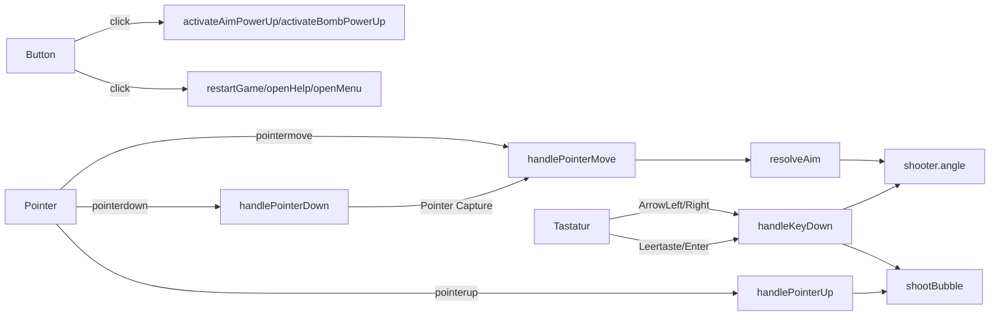

# Steuerungssystem – Controls

> Dokumentiert das Event-System und die Steuerung des Bubble-Shooters.

---

## 1. Event-Architektur

```
Input-Device → DOM-Event → Event-Handler → (ggf. Koordinaten-Transformation) → Spiel-Logik
```

Maus, Touch und Stift laufen über **Pointer Events** durch dieselben Handler – es gibt keine separate Touch-Logik mehr:



`pointerdown` beginnt das Zielen (Pointer Capture, kein Schuss), `pointermove` aktualisiert Winkel und Trajektorie, `pointerup` löst den Schuss aus. Dadurch können Touch-Nutzer wie Maus-Nutzer erst ziehen/zielen und dann loslassen, statt beim ersten Kontakt sofort zu schießen.

---

## 2. Zielen (Aiming)

### 2.1 Zentrale Winkelauflösung: `resolveAim()`

`resolveAim()` ist die **einzige Quelle der Wahrheit** für die Schussrichtung. Sie berechnet die Winkelabweichung von der Aufwärtsachse (-90°), begrenzt diese Abweichung symmetrisch auf `±currentAngleLimit` und liefert sowohl den Winkel als auch den normierten Richtungsvektor:

```javascript
resolveAim(targetX, targetY) {
    const dx = targetX - this.shooter.x;
    const dy = targetY - this.shooter.y;
    const upAngle = -Math.PI / 2;
    let delta = Math.atan2(dy, dx) - upAngle;
    while (delta > Math.PI) delta -= Math.PI * 2;
    while (delta < -Math.PI) delta += Math.PI * 2;

    const limit = this.currentAngleLimit;
    delta = Math.max(-limit, Math.min(limit, delta));

    const angle = upAngle + delta;
    return { angle, dirX: Math.cos(angle), dirY: Math.sin(angle) };
}
```

`handlePointerMove()` (Vorschau/Trajektorie), `shootBubble()` (tatsächlicher Schuss) und die Pfeiltasten-Steuerung verwenden **alle** denselben `resolveAim()`-Aufruf bzw. dieselbe Winkel-Klemmung. Es gibt keinen zweiten, unbegrenzten Pfad mehr, über den ein Abwärtsschuss entstehen könnte.

### 2.2 Winkel-Limits

```javascript
baseAngleLimit = Math.PI / 2.5;   // ~72° (normal)
aimAngleLimit  = Math.PI / 1.8;   // ~100° (mit Zielhilfe-Power-Up)
```

### 2.3 Aim-Clamping

Die X-Koordinate des Zielpunkts wird auf den Bereich `[gridLeftEdge + radius, gridRightEdge - radius]` begrenzt:

```javascript
clampAimX(x) {
    const left = this.gridLeftEdge + this.bubbleRadius;
    const right = this.gridRightEdge - this.bubbleRadius;
    return Math.max(left, Math.min(right, x));
}
```

---

## 3. Schießen (Shooting)

```javascript
handlePointerUp(e) {
    if (!this.isAiming) return;
    this.isAiming = false;
    this.canvas.releasePointerCapture(e.pointerId);
    this.handlePointerMove(e);           // letzte Zielposition übernehmen
    this.trajectoryLine.style.display = 'none';
    if (!this.gameRunning) return;
    this.shootBubble(this.lastAimX, this.lastAimY);
}
```

```javascript
shootBubble(targetX, targetY) {
    if (this.activeBubble) return;       // Bubble blockt weitere Schüsse

    const aimX = this.clampAimX(targetX);
    const aim = this.resolveAim(aimX, targetY);
    this.shooter.angle = aim.angle;

    // 480px/s ≈ vorheriges festes 8px/Frame @ 60fps, jetzt zeitbasiert
    const bubble = {
        x: this.shooter.x,
        y: this.shooter.y,
        dirX: aim.dirX,
        dirY: aim.dirY,
        speed: 480,
        color: this.currentBubble,
        radius: this.bubbleRadius,
        powerUp: null
    };

    if (this.bombArmed) {
        bubble.powerUp = 'bomb';
        this.bombArmed = false;
        this.setPowerUpState(this.bombBtn, false);
    }
    if (this.aimAssistShots > 0) {
        this.aimAssistShots--;
        if (this.aimAssistShots === 0) {
            this.currentAngleLimit = this.baseAngleLimit;
            this.setPowerUpState(this.aimBtn, false);
        }
    }

    this.animateBubble(bubble);
    this.nextBubble();
    this.shotsFired++;
    // Row-Push passiert NICHT hier mehr, siehe level-system.md → resolveTurn()
}
```

Die Bubble bewegt sich mit einer zeitbasierten Geschwindigkeit (px/s statt px/Frame, siehe `updateActiveBubble(deltaMs)` in `game-mechanics.md`), sodass die Schussgeschwindigkeit unabhängig von der Bildwiederholrate ist.

---

## 4. Power-Up-Buttons

| Button | ID | Handler | Beschreibung |
|---|---|---|---|
| Zielhilfe 🎯 | `#aimBtn` | `activateAimPowerUp()` | Toggle, verbraucht eine Aufladung beim Scharfstellen |
| Bombe 💣 | `#bombBtn` | `activateBombPowerUp()` | Toggle, verbraucht eine Aufladung beim Scharfstellen |

Jedes Power-Up hat `maxPowerUpCharges` (Standard: 1) Aufladungen pro Level, die beim Scharfstellen (nicht erst beim Abschuss) verbraucht werden. `resetPowerUps()` füllt sie bei Levelwechsel/Neustart wieder auf; die Buttons werden über `updatePowerUpAvailability()` per `disabled` deaktiviert, sobald keine Aufladung mehr übrig ist:

```javascript
activateBombPowerUp() {
    if (!this.gameRunning) return;
    if (this.bombArmed) {
        this.bombArmed = false;
        this.setPowerUpState(this.bombBtn, false);
        return;
    }
    if (this.bombCharges <= 0) return;
    this.bombCharges--;
    this.bombArmed = true;
    this.setPowerUpState(this.bombBtn, true);
    this.updatePowerUpAvailability();
}
```

---

## 5. Overlay-Steuerung (Game Over / Hilfe / Menü)

Alle drei Overlays (`#gameOverlay`, `#helpOverlay`, `#menuOverlay`) sind `role="dialog"` mit `aria-modal="true"` und werden über die gemeinsamen Helfer `openDialog()`/`closeDialog()` gesteuert, die den Fokus auf ein sinnvolles Element im Dialog setzen und beim Schließen zum auslösenden Button zurückgeben:

```javascript
openDialog(overlayEl, focusEl, triggerEl) {
    this.activeDialogTrigger = triggerEl || null;
    overlayEl.classList.remove('hidden');
    if (focusEl) focusEl.focus();
}

closeDialog(overlayEl) {
    overlayEl.classList.add('hidden');
    if (this.activeDialogTrigger) this.activeDialogTrigger.focus();
    this.activeDialogTrigger = null;
}
```

Das Menü-Overlay pausiert zusätzlich das Spiel (`this.paused = true`) und stoppt damit auch den Game-Loop, bis es über `closeMenu()` (Button „Fortsetzen“) wieder geschlossen wird.

---

## 6. Tastatur

Das Spiel ist vollständig per Tastatur bedienbar, über einen globalen `keydown`-Listener in `setupEventListeners()`:

| Taste | Wirkung |
|---|---|
| `←` / `→` | Zielwinkel in `keyboardAimStep`-Schritten (5°) innerhalb des aktuellen Winkel-Limits ändern |
| `Leertaste` / `Enter` | Schuss auf die zuletzt anvisierte Richtung auslösen |
| `Escape` | Offenes Hilfe- oder Menü-Overlay schließen |

Tastatureingaben werden ignoriert, während Hilfe- oder Menü-Overlay offen sind (außer `Escape`) oder das Spiel pausiert/beendet ist.

---

## 7. Responsive Touch-Anpassungen

- `touch-action: none` auf dem Canvas verhindert Scrollen/Zoomen während des Zielens
- Pointer Capture sorgt dafür, dass `pointermove`/`pointerup` auch außerhalb des Canvas ankommen, falls der Finger/die Maus während des Zielens die Canvas-Grenze verlässt
- Keine separaten Touch-Layouts – die responsive CSS passt die UI-Größe an; `.game-area` bekommt im gestapelten Mobile-Layout `flex: 1 1 auto` statt einer festen/kollabierenden Höhe
