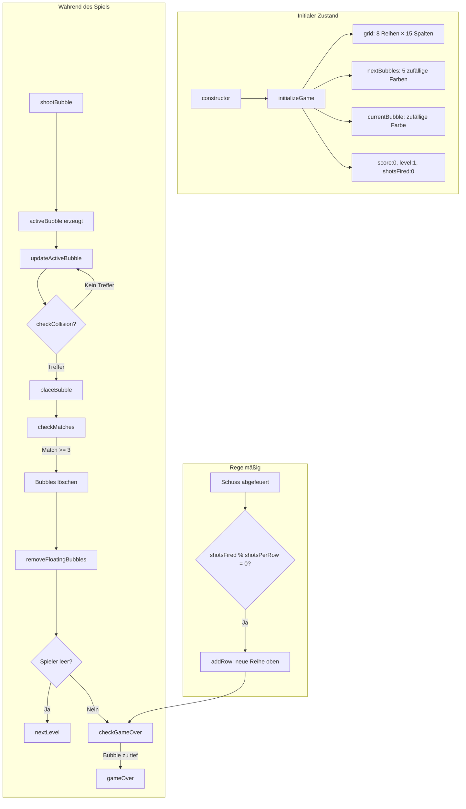

# Datenmodell – jabs

> Vollständige Spezifikation des internen Datenmodells aller Spielzustände.
> Gültig für KI-Agenten und Entwickler.

---

## 1. Bubble-Objekt

Jede Bubble im Grid oder in der Luft ist ein einfaches JavaScript-Objekt:

```typescript
interface Bubble {
    color: string;       // HEX-Farbe: '#ff595e' | '#ffca3a' | '#8ac926' | '#1982c4' | '#6a4c93' | '#ff924c' | '#2ec4b6' | '#f72585'
    x: number;           // Canvas-X-Position (Pixel)
    y: number;           // Canvas-Y-Position (Pixel)
    radius: number;      // Bubble-Radius (Pixel)
    dirX?: number;       // normierter Richtungsvektor X (nur bei aktiver/fliegender Bubble)
    dirY?: number;       // normierter Richtungsvektor Y (nur bei aktiver/fliegender Bubble)
    speed?: number;      // Geschwindigkeit in px/s (nur bei aktiver/fliegender Bubble)
    powerUp?: string | null; // Power-Up-Typ: 'bomb' | null (nur bei aktiver Bubble)
}
```

### Farb-Palette

| Index | Farbe | HEX |
|---|---|---|
| 0 | Rot | `#ff595e` |
| 1 | Gelb | `#ffca3a` |
| 2 | Grün | `#8ac926` |
| 3 | Blau | `#1982c4` |
| 4 | Violett | `#6a4c93` |
| 5 | Orange | `#ff924c` |
| 6 | Türkis | `#2ec4b6` |
| 7 | Pink | `#f72585` |

---

## 2. Grid (Spielfeld)

### Struktur

```typescript
grid: Array<Array<Bubble | undefined>>;
```

- **Typ**: 2D-Array (Array von Zeilen, jede Zeile ein Array von Spalten)
- **Zeilen** = `grid[row]` (0 = oberste Reihe)
- **Spalten** = `grid[row][col]` (0 = linkeste Zelle)
- **Leere Zelle** = `undefined` (wird per `delete grid[row][col]` gesetzt)
- **Größe**: Immer `columnCount` (15) Spalten pro Reihe, Reihen wachsen dynamisch

### Reihen-Offsets

```typescript
rowOffsets: number[];
// rowOffsets[row] = 0 → erste Bubble bei x = 0 + radius
// rowOffsets[row] = 1 → erste Bubble bei x = bubbleRadius (versetzt)
```

- Wird bei `createInitialGrid()` befüllt und bei `addRow()` per `unshift` erweitert
- Wird bei `getRowOffsetFlag(row)` bei Bedarf berechnet und gecached

### Grid-Metriken

```typescript
columnCount: 15;          // Spaltenanzahl (fix)
fixedColumns: 15;         // identisch mit columnCount
initialRows: 8;           // Start-Reihen
bottomFreeRows: 10;       // Reservierte Reihen unterhalb der Start-Position
bubbleRadius: number;     // Dynamisch berechnet (Resize-Event)
rowHeight: number;        // bubbleRadius * √3
gridLeftEdge: number;     // Linke Kante = 0
gridRightEdge: number;    // Rechte Kante = gridWidth
gridWidth: number;        // columnCount * 2 * bubbleRadius + bubbleRadius
gridTopOffset: number;    // topPadding + bubbleRadius
```

---

## 3. Shooter

```typescript
shooter: {
    x: number;      // Canvas-X (Mitte des Spielfelds)
    y: number;      // Canvas-Y (canvas.height - 100)
    angle: number;  // Winkel in Radian (-angleLimit bis +angleLimit)
};
```

- `x` wird bei Resize auf `gridLeftEdge + gridWidth / 2` gesetzt
- `y` ist relativ zum Canvas-Boden (`canvas.height - 100`)
- Winkel wird durch `handleMouseMove()` gesetzt

---

## 4. Aktive Bubble (fliegend)

```typescript
activeBubble: {
    x: number;       // Aktuelle Canvas-X-Position
    y: number;       // Aktuelle Canvas-Y-Position
    dirX: number;    // normierter Richtungsvektor X (aus resolveAim())
    dirY: number;    // normierter Richtungsvektor Y (aus resolveAim())
    speed: number;   // Geschwindigkeit in px/s (zeitbasiert, nicht mehr px/Frame)
    color: string;   // HEX-Farbe
    radius: number;  // Bubble-Radius
    powerUp: 'bomb' | null;  // Power-Up-Modifikator
} | null;            // null, wenn keine Bubble fliegt
```

- Existiert nur während des Flugs einer Bubble
- Wird nach Platzierung/Kollision auf `null` gesetzt
- Geschwindigkeit wird beim Schuss berechnet (`speed = 8 Pixel/Frame`)

---

## 5. Spiel-Zustand (Game State)

```typescript
// Punktestand
score: number;            // Aktuelle Punktzahl (Start: 0)

// Level
level: number;            // Aktueller Level (Start: 1)

// Schuss-Zähler
shotsFired: number;       // Schüsse seit Spielstart (Start: 0)
shotsPerRow: number;      // Schüsse pro neuer Reihe (Standard: 5)

// Queue
currentBubble: string;    // Farbe der aktuell geladenen Bubble
nextBubbles: string[];    // Nächste 5 Farben [0..4]

// Spiel-Status
gameRunning: boolean;     // true = Spiel läuft | false = Game Over

// Power-Up-Zustände
aimAssistShots: number;   // Verbleibende Schüsse mit Zielhilfe (0 = aus)
bombArmed: boolean;       // true = nächster Schuss ist Bombe
currentAngleLimit: number; // Aktueller Winkel-Limit (baseAngleLimit | aimAngleLimit)

// Konstanten
baseAngleLimit: Math.PI / 2.5;  // ~72°
aimAngleLimit: Math.PI / 1.8;   // ~100°
```

---

## 6. Datenfluss-Diagramm (State-Änderungen)


