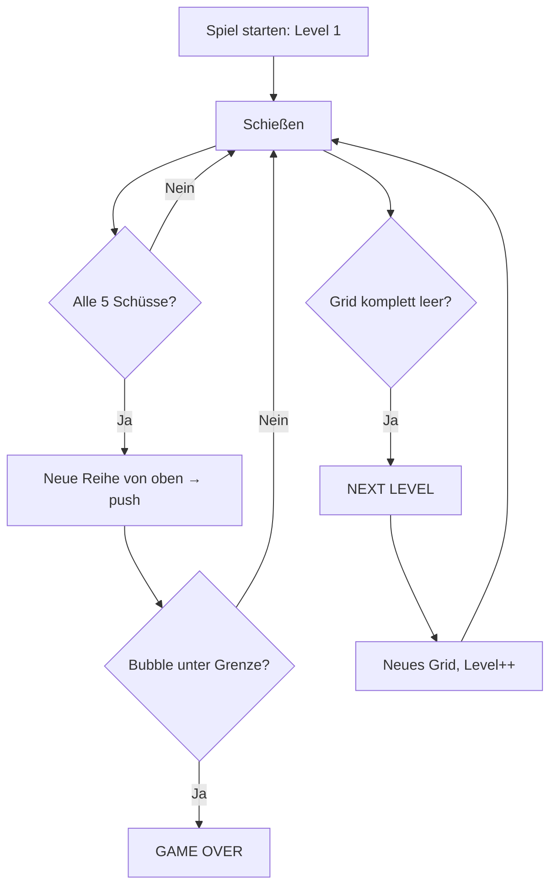

# Level-System – jabs

> Dokumentiert den Spielfortschritt: Row-Push, Level-Aufstieg und Game-Over.

---

## 1. Level-Zyklus



---

## 2. Row-Push (Neue Reihe)

### 2.1 Auslöser

Nach **jeweils 5 Schüssen** (`this.shotsPerRow`) wird eine neue Reihe von oben in das Grid eingeschoben – aber erst, **nachdem** der auslösende Schuss vollständig aufgelöst ist (Platzierung, Matches, Floating-Bubbles). `shootBubble()` selbst löst keinen Row-Push mehr aus:

```javascript
// In shootBubble(): nur noch der Zähler, kein addRow()
this.shotsFired++;

// In placeBubble(), am Ende jedes Zweigs (normal + Bombe):
this.resolveTurn();

// resolveTurn() entscheidet erst NACH der Platzierung:
resolveTurn() {
    if (this.checkWinCondition()) {
        this.nextLevel();
        return;
    }
    if (this.shotsFired % this.shotsPerRow === 0) {
        this.addRow();
    } else {
        this.checkGameOver();
    }
}
```

Dadurch kann ein Schuss, der durch Match/Floating das Feld noch retten würde, nicht mehr durch einen verfrühten Row-Push/Game-Over-Check "überholt" werden.

### 2.2 `addRow()` im Detail

```javascript
addRow() {
    const cols = this.columnCount;      // 15

    // 1. Offset-Flag berechnen (wechselt pro Reihe)
    const firstFlag = this.rowOffsets[0] ?? 0;
    const newFlag = firstFlag === 0 ? 1 : 0;
    this.rowOffsets.unshift(newFlag);

    // 2. Neue Reihe mit zufälligen Farben füllen
    const newRow = new Array(cols);
    for (let col = 0; col < cols; col++) {
        newRow[col] = this.createBubble(0, col, this.getRandomColor());
    }

    // 3. Alle bestehenden Reihen nach unten verschieben
    for (let row = this.grid.length - 1; row >= 0; row--) {
        this.grid[row + 1] = this.grid[row];
    }

    // 4. Neue Reihe oben einfügen
    this.grid[0] = newRow;

    // 5. Koordinaten neu berechnen
    this.updateGridPositions();

    // 6. Prüfen: Game Over?
    this.checkGameOver();
}
```

### 2.3 Visuelle Konsequenz

Nach dem Push ist das Grid um eine Reihe gewachsen. Alle Bubbles sind nach unten gerutscht → der Abstand zum Shooter wird kleiner. Irgendwann unterschreitet eine Bubble die Game-Over-Grenze.

---

## 3. Level-Aufstieg

### 3.1 Bedingung

Das Grid ist komplett leer – das passiert meist durch eine Kettenreaktion aus Match + Floating Bubbles.

```javascript
checkWinCondition() {
    for (let row = 0; row < this.grid.length; row++) {
        for (let col = 0; col < this.grid[row].length; col++) {
            if (this.grid[row][col]) return false;  // Mindestens eine Bubble gefunden
        }
    }
    return true;  // Grid ist leer → Level gewonnen
}
```

### 3.2 `nextLevel()`

```javascript
nextLevel() {
    this.level++;                    // Level hochzählen
    this.shotsFired = 0;             // Row-Push-Zyklus zurücksetzen
    this.resetPowerUps();            // Power-UPs zurücksetzen
    this.createInitialGrid();        // Neues 8×15 Grid
    this.generateNextBubbles();      // Neue Queue
    this.currentBubble = this.getRandomColor();
    this.updateUI();                 // DOM aktualisieren
}
```

**Wichtig**: Der Punktestand (`score`) bleibt erhalten und der Highscore wird beim Game-Over/Neustart aktualisiert (`this.highscore`). Der Level wird nur hochgezählt – es gibt keine Multiplikatoren oder steigende Schwierigkeit; `shotsFired` startet pro Level bei 0, damit die Row-Push-Frist eines neuen Levels nicht vom Rest des vorherigen Levels abhängt.

---

## 4. Game Over

### 4.1 Bedingung

```javascript
checkGameOver() {
    const limit = this.shooter.y - this.bubbleRadius * 2;

    for (let row = 0; row < this.grid.length; row++) {
        for (let col = 0; col < this.grid[row].length; col++) {
            const bubble = this.grid[row][col];
            if (bubble && bubble.y >= limit) {
                this.triggerGameOver();
                return;
            }
        }
    }
}
```

Die **Game-Over-Grenze** liegt `2 × bubbleRadius` oberhalb der Shooter-Position (`shooter.y`).

### 4.2 `triggerGameOver()`

```javascript
triggerGameOver() {
    if (!this.gameRunning) return;           // Nur einmal auslösen

    this.gameRunning = false;
    this.activeBubble = null;                // Fliegende Bubble verschwindet
    this.resetPowerUps();

    this.showOverlay('Game Over', `Punkte: ${this.score}`);
}
```

### 4.3 Neustart

```javascript
restartGame() {
    this.hideOverlay();
    this.score = 0;
    this.level = 1;
    this.shotsFired = 0;
    this.gameRunning = true;
    this.activeBubble = null;
    this.resetPowerUps();
    this.createInitialGrid();           // Frisches 8×15 Grid
    this.generateNextBubbles();
    this.currentBubble = this.getRandomColor();
    this.updateUI();
}
```

---

## 5. Schwierigkeits-Progression

Derzeit gibt es **keine steigende Schwierigkeit** pro Level:

- Neue Reihen kommen immer nach 5 Schüssen (`shotsPerRow = 5`)
- Die Geschwindigkeit der fliegenden Bubble ist konstant (`speed = 8`)
- Neue Reihen haben immer zufällige Farben
- Die Grid-Größe nach `nextLevel()` ist immer 8 Start-Reihen

> **Hinweis für KI-Agenten**: Mögliche Verbesserungen wären:
> - `shotsPerRow` pro Level reduzieren (z. B. 5 → 4 → 3)
> - Bubble-Geschwindigkeit erhöhen
> - Anzahl der Farben pro Level erhöhen
> - Initial-Reihen pro Level erhöhen
