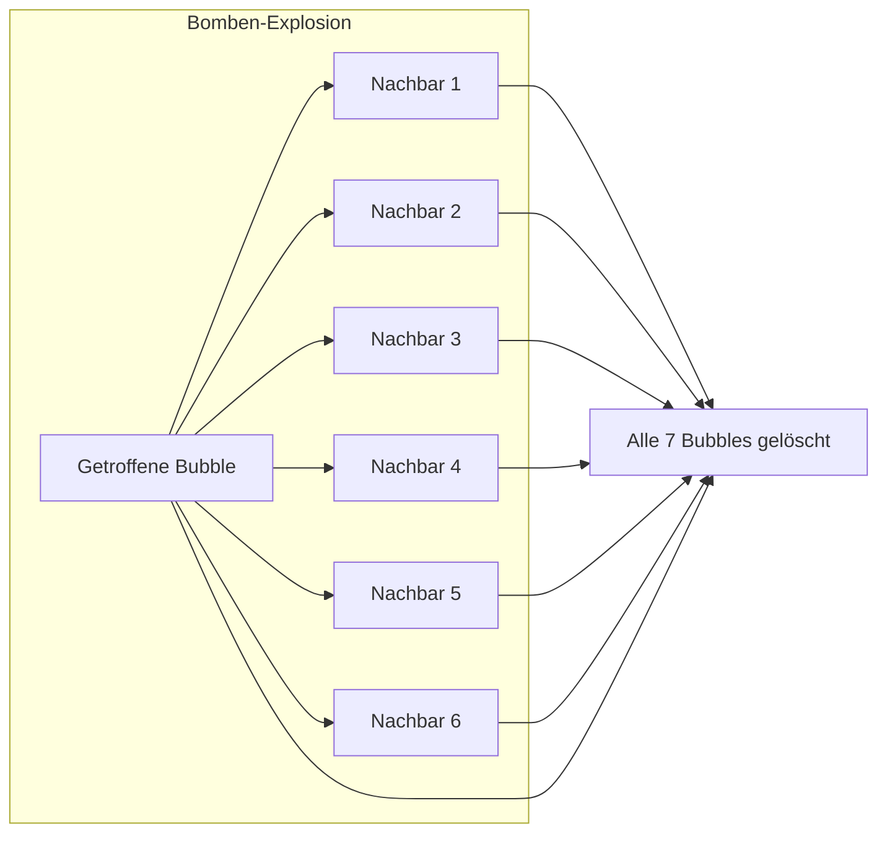

# Power-Up-System – jabs

> Dokumentiert die beiden Power-Ups: Zielhilfe (🎯) und Bombe (💣).

---

## 1. Übersicht

| Power-Up | Button | Effekt | Dauer | Max. Aufladungen |
|---|---|---|---|---|
| 🎯 Zielhilfe | `#aimBtn` | Erweiterter Schusswinkel (100° statt 72°), längere Trajektorie (280px statt 200px) | 1 Schuss | 1 |
| 💣 Bombe | `#bombBtn` | Nächster Schuss entfernt die getroffene Bubble + alle 6 Nachbarn | 1 Schuss | 1 |

Beide Power-Ups sind **Toggle-Schalter**: Ein erneuter Klick deaktiviert sie vor dem Schuss.

---

## 2. Zielhilfe (Aim Assist)

### 2.1 Aktivierung

```javascript
activateAimPowerUp() {
    if (!this.gameRunning) return;

    if (this.aimAssistShots > 0) {
        // Deaktivieren (Toggle aus)
        this.aimAssistShots = 0;
        this.currentAngleLimit = this.baseAngleLimit;
        this.setPowerUpState(this.aimBtn, false);
        return;
    }

    // Aktivieren (Toggle an)
    this.aimAssistShots = 1;
    this.currentAngleLimit = this.aimAngleLimit;
    this.setPowerUpState(this.aimBtn, true);
}
```

### 2.2 Effekte während des Zielens

| Eigenschaft | Normal | Zielhilfe aktiv |
|---|---|---|
| `currentAngleLimit` | `π / 2.5` (~72°) | `π / 1.8` (~100°) |
| Trajektorien-Länge | 200px | 280px |

### 2.3 Verbrauch

Nach dem Schuss in `shootBubble()`:

```javascript
if (this.aimAssistShots > 0) {
    this.aimAssistShots--;
    if (this.aimAssistShots === 0) {
        this.currentAngleLimit = this.baseAngleLimit;
        this.setPowerUpState(this.aimBtn, false);  // Button visuell deaktivieren
    }
}
```

---

## 3. Bombe (Bomb)

### 3.1 Aktivierung

```javascript
activateBombPowerUp() {
    if (!this.gameRunning) return;
    this.bombArmed = !this.bombArmed;            // Toggle
    this.setPowerUpState(this.bombBtn, this.bombArmed);
}
```

### 3.2 Explosion

Bei der Platzierung prüft `placeBubble()` auf `bubble.powerUp === 'bomb'`:

```javascript
if (bubble.powerUp === 'bomb') {
    const removed = this.removeBombCluster(row, col);
    if (removed > 0) {
        this.score += removed * 15;    // 15 Punkte pro getroffener Bubble
    }
    this.removeFloatingBubbles();      // Trümmer entfernen
    if (this.checkWinCondition()) {
        this.nextLevel();
    }
    this.checkGameOver();
    return;                            // ← Kein Match-3 Check nach Bombe
}
```

### 3.3 Bomben-Cluster

```javascript
removeBombCluster(row, col) {
    // Getroffene Bubble + alle 6 Nachbarn
    const toRemove = new Set([`${row}-${col}`]);

    this.getNeighbors(row, col).forEach(({ r, c }) => {
        toRemove.add(`${r}-${c}`);
    });

    let removed = 0;
    toRemove.forEach((key) => {
        const [r, c] = key.split('-').map(Number);
        if (this.grid[r]?.[c]) {
            delete this.grid[r][c];
            removed++;
        }
    });

    return removed;
}
```



**Wichtig**: Die Bombe löst **keinen** Match-3-Check aus – sie entfernt immer genau die getroffene Bubble + ihre Nachbarn, unabhängig von der Farbe.

---

## 4. Button-Visualisierung

```javascript
setPowerUpState(button, active) {
    if (!button) return;
    button.classList.toggle('active', active);
}
```

```css
.power-up-btn.active {
    box-shadow: 0 0 15px rgba(255, 255, 255, 0.7);
    border-color: #ffd700;  /* Goldener Rand = aktiv */
}
```

---

## 5. Reset bei Status-Wechsel

Power-Ups werden zurückgesetzt in:

| Situation | Methode |
|---|---|
| Spielstart | `initializeGame()` → `resetPowerUps()` |
| Neustart | `restartGame()` → `resetPowerUps()` |
| Level-Aufstieg | `nextLevel()` → `resetPowerUps()` |

```javascript
resetPowerUps() {
    this.aimAssistShots = 0;
    this.bombArmed = false;
    this.currentAngleLimit = this.baseAngleLimit;
    this.setPowerUpState(this.aimBtn, false);
    this.setPowerUpState(this.bombBtn, false);
}
```
