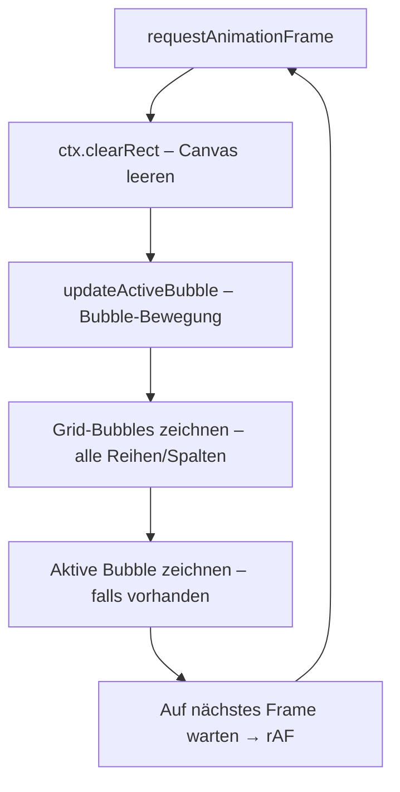

# Rendering-Pipeline – jabs

> Dokumentiert die visuelle Darstellung des Bubble-Shooters: Canvas-2D-API, Bubble-Effekte und SVG-Trajektorie.

---

## 1. Rendering-Stack

| Schicht | Technologie | Zuständigkeit |
|---|---|---|
| **Bubbles + Grid** | HTML5 Canvas (`#gameCanvas`) | Alle Bubble-Objekte, Hintergrund |
| **Trajektorie** | SVG (`#trajectory`) | Gestrichelte Ziellinie |
| **UI-Overlays** | CSS/DOM | Score, Level, Queue, Game Over |

---

## 2. Canvas-Rendering (Game Loop)

Der Game Loop läuft mit `requestAnimationFrame` und wird nicht unterbrochen, solange das Spiel läuft:



### 2.1 Reihenfolge ist essenziell

```javascript
gameLoop() {
    this.ctx.clearRect(0, 0, this.canvas.width, this.canvas.height);  // 1. Löschen
    this.updateActiveBubble();                                          // 2. Physik
    // 3. Grid zeichnen
    for (let row in this.grid) {
        for (let col in this.grid[row]) {
            if (this.grid[row][col]) {
                this.drawBubble(gridBubble.x, gridBubble.y, gridBubble.color);
            }
        }
    }
    // 4. Aktive Bubble
    if (this.activeBubble) {
        this.drawBubble(this.activeBubble.x, this.activeBubble.y, this.activeBubble.color);
    }
    requestAnimationFrame(() => this.gameLoop());  // 5. Nächstes Frame
}
```

---

## 3. Bubble-Rendering (3D-Effekt)

Jede Bubble wird mit einem **radialen Farbverlauf + Glanzlicht + Schatten** gezeichnet:

```javascript
drawBubble(x, y, color, radius = this.bubbleRadius) {
    this.ctx.save();

    // ---- 1. Schatten ----
    this.ctx.shadowColor = 'rgba(0, 0, 0, 0.3)';
    this.ctx.shadowBlur = 5;
    this.ctx.shadowOffsetX = 2;
    this.ctx.shadowOffsetY = 2;

    // ---- 2. Hauptkörper (Radialverlauf) ----
    const gradient = this.ctx.createRadialGradient(
        x - radius/3, y - radius/3, 0,  // Lichtquelle (oben-links)
        x, y, radius                     // Mittelpunkt & Radius
    );
    gradient.addColorStop(0, this.lightenColor(color));   // Helle Seite
    gradient.addColorStop(1, color);                       // Basis-Farbe

    this.ctx.fillStyle = gradient;
    this.ctx.beginPath();
    this.ctx.arc(x, y, radius, 0, Math.PI * 2);
    this.ctx.fill();

    // ---- 3. Glanzlicht (Specular Highlight) ----
    this.ctx.shadowColor = 'transparent';  // Schatten für Highlight aus
    this.ctx.fillStyle = 'rgba(255, 255, 255, 0.3)';
    this.ctx.beginPath();
    this.ctx.arc(x - radius/3, y - radius/3, radius/3, 0, Math.PI * 2);
    this.ctx.fill();

    this.ctx.restore();
}
```

### 3.1 Farb-Manipulation

```javascript
// Aufhellen für Verlauf
lightenColor(color) {
    const hex = color.replace('#', '');
    const r = Math.min(255, parseInt(hex.substr(0, 2), 16) + 60);
    const g = Math.min(255, parseInt(hex.substr(2, 2), 16) + 60);
    const b = Math.min(255, parseInt(hex.substr(4, 2), 16) + 60);
    return `#${r.toString(16).padStart(2, '0')}${g.toString(16).padStart(2, '0')}${b.toString(16).padStart(2, '0')}`;
}

// Abdunkeln für Border in der Queue
darkenColor(color) {
    const hex = color.replace('#', '');
    const r = Math.max(0, parseInt(hex.substr(0, 2), 16) - 40);
    const g = Math.max(0, parseInt(hex.substr(2, 2), 16) - 40);
    const b = Math.max(0, parseInt(hex.substr(4, 2), 16) - 40);
    return `#${r.toString(16).padStart(2, '0')}${g.toString(16).padStart(2, '0')}${b.toString(16).padStart(2, '0')}`;
}
```

---

## 4. SVG-Trajektorie (Zielhilfe)

Die Zielhilfe wird als SVG-`<line>` über dem Canvas dargestellt:

```html
<svg id="trajectory" style="position: absolute; top: 0; left: 0; pointer-events: none;">
    <line id="trajectoryLine" class="trajectory-line" style="display: none;"/>
</svg>
```

```css
.trajectory-line {
    stroke: #00bcd4;          /* Türkise Farbe */
    stroke-width: 3;
    stroke-dasharray: 5, 5;   /* Gestrichelt */
    opacity: 0.7;
}
```

### 4.1 Dynamische Aktualisierung

```javascript
updateTrajectory(mouseX, mouseY) {
    const startX = this.shooter.x;
    const startY = this.shooter.y;

    const dx = mouseX - startX;
    const dy = mouseY - startY;
    const distance = Math.hypot(dx, dy);

    if (distance < 0.0001) { line.style.display = 'none'; return; }

    // Maximale Linien-Länge (abhängig von Zielhilfe)
    const maxDistance = this.aimAssistShots > 0 ? 280 : 200;

    // Endpunkt berechnen
    let endX = startX + (dx / distance) * Math.min(distance, maxDistance);
    let endY = startY + (dy / distance) * Math.min(distance, maxDistance);

    // Auf Grid-Grenzen clammen
    if (endX < leftBound) { /* Endpunkt an linke Wand anpassen */ }
    if (endX > rightBound) { /* Endpunkt an rechte Wand anpassen */ }

    line.setAttribute('x1', startX);
    line.setAttribute('y1', startY);
    line.setAttribute('x2', endX);
    line.setAttribute('y2', endY);
    line.style.display = 'block';
}
```

---

## 5. UI-Updates (DOM)

Neben dem Canvas-Rendering aktualisiert `updateUI()` DOM-Elemente:

| DOM-Element | Wert | Aktualisierung |
|---|---|---|
| `#score` | `this.score` | `textContent` |
| `#level` | `this.level` | `textContent` |
| `#currentBubble` | `this.currentBubble` | `style.background` (Radialverlauf) |
| `#queue1` … `#queue5` | `this.nextBubbles[0..4]` | `style.background` + `style.border` |

Die Bubble-Farben in der Queue werden mit einem `radial-gradient` dargestellt:

```javascript
currentBubbleEl.style.background = `radial-gradient(circle, ${this.currentBubble}, ${this.darkenColor(this.currentBubble)})`;
```

---

## 6. Canvas-Resize (Responsive)

Bei jedem `window.resize`-Event wird `resizeCanvas()` aufgerufen:

1. **Grid-Metriken neu berechnen**: `bubbleRadius`, `rowHeight`, `gridWidth`
2. **Canvas-Abmessungen setzen**: `canvas.width`, `canvas.height`
3. **Grid-Positionen aktualisieren**: `updateGridPositions()` – alle Bubbles neu positionieren
4. **Shooter neu zentrieren**: `shooter.x = gridLeftEdge + gridWidth / 2`
5. **SVG-Größe anpassen**: `trajectory.style.width/height`

### Radius-Berechnungsformel

```javascript
bubbleRadius = Math.min(
    availableWidth / (columnCount * 2 + 1),                // Breiten-Limit
    (shooterY - topPadding) / ((rows - 1 + freeRows) * √3 + 3)  // Höhen-Limit
);
```

---

## 7. Overlay (Game Over)

Das Overlay ist ein absolut positioniertes `<div>` über dem Game Area:

```css
.game-overlay {
    position: absolute;
    top: 0; left: 0; width: 100%; height: 100%;
    background: rgba(0, 0, 0, 0.6);
    display: flex;
    align-items: center;
    justify-content: center;
    z-index: 10;
}
.game-overlay.hidden {
    display: none;
}
```

Der Overlay-Container wird via `classList.toggle('hidden')` ein-/ausgeblendet – kein `display: block/none` per JS.
